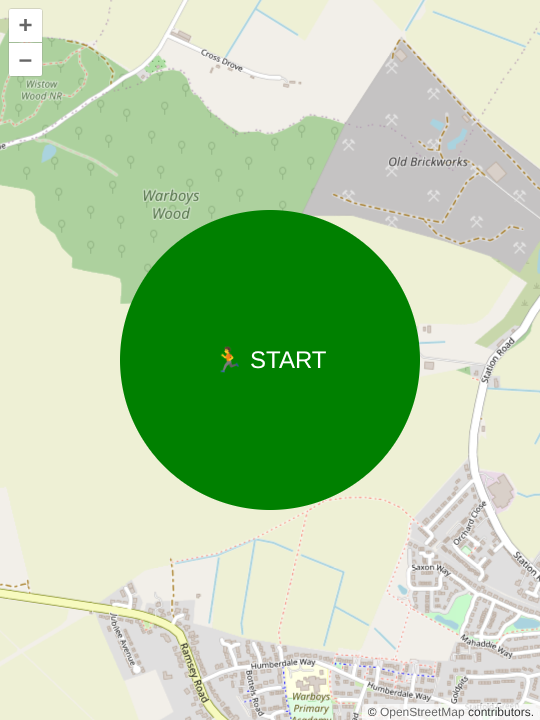
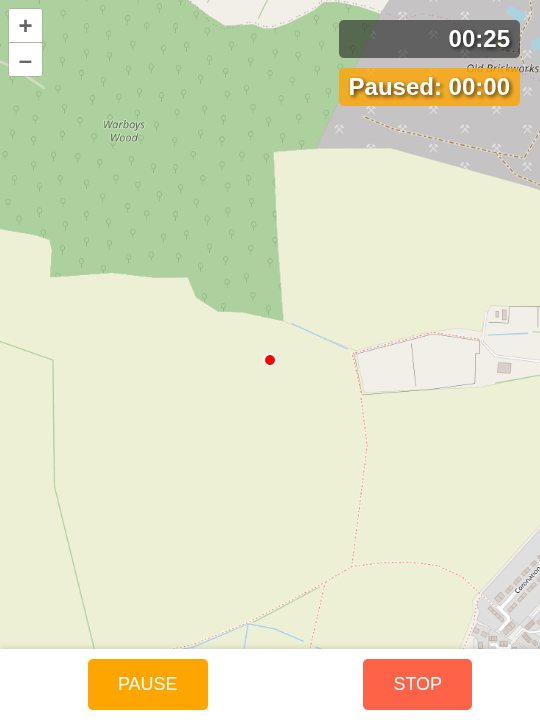

#  RunningMan

As proof of principle, I've created a simple running app that tracks your location and time. It has a start button to begin tracking, a pause button to pause the tracking, and a stop button to end the session. The app displays the duration of the run and the distance covered. The code is written in JavaScript and uses the Geolocation API to track the user's location and plot on-screen. After a minute of inactivity, the timer will automatically pause and count the paused-duration so that it can be decremented from the overall time.

https://apaulanthony.github.io/RunningMan/dist/index.html

I used OpenLayers [Geolocation example](https://openlayers.org/en/latest/examples/geolocation.html) as a starting point for the project, introducing me to [Vite](https://www.npmjs.com/package/vite). I particularly appreciate Vite's simple approach to bunding of ESM and handling of SASS.

## Installation

Through the magic of [PWA](https://developer.mozilla.org/en-US/docs/Web/Progressive_web_apps) this app can be installed on to phones and (less usefully) computers.

1) In mobile browsers (Chrome, Edge, Safari)
    - Open the [site](https://apaulanthony.github.io/RunningMan/dist/index.html) in the device's browser
    - The browser may show a prompt:
        - Chrome/Edge: “Install app” bubble in address bar or bottom.
        - Safari iOS: share icon → “Add to Home Screen”.
    - Tap "Install" / "Add to Home Screen".
    - The app is added like a normal native app icon.
2) On desktop browsers
    - Open [site](https://apaulanthony.github.io/RunningMan/dist/index.html) in Chrome/Edge/Brave.
    - Click the install icon in the address bar (plus/minus circle) or menu:
        - Chrome/Edge: Menu → “Install [App]”.
    - Confirm.
    - It now launches in standalone window and appears in app menu/start menu.

If you tap-and-hold on the installed app's icon there's an additional shortcut to launch and immediately start the run timer.

## Screenshots

## ToDo:
- [X] ~~Make PWA~~
- [X] ~~Display captured run data. Implement download/clear~~
- [X] ~~Add elevatation and timestamps to the stored route points~~
- [X] ~~Expose maintenance functions (clear cache, fix data)~~
- [X] ~~Apply version control to DB/SW based on package.json version~~
- [ ] Push the tracking to happen in the background (service worker)
- [ ] Config panel
- [ ] Update screenshots